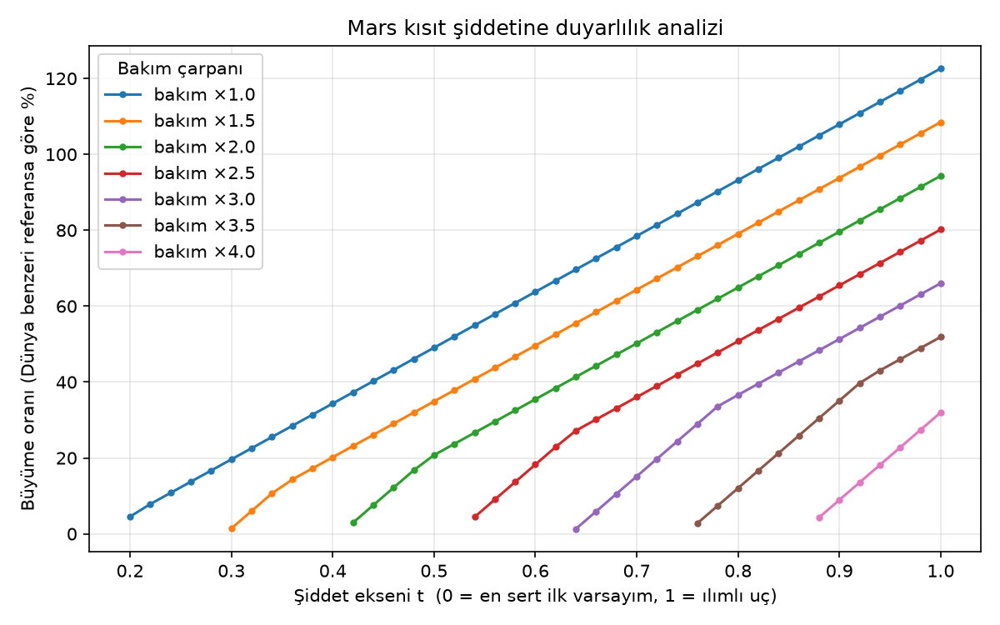
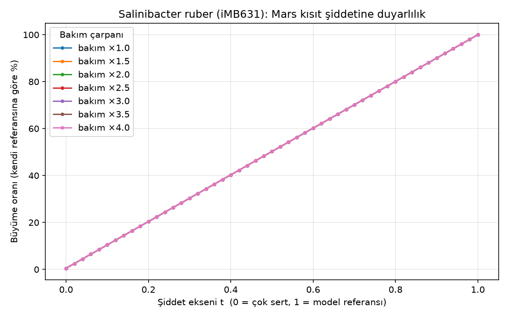

# Mars Yüzey Koşulları İçin Minimal Gen Ağı Modellemesi

**IAC 2026 · IAF/IAA Space Life Sciences Symposium (A1) · Paper ID 114761**
Yazar: Esinnur Çalışır, İstanbul Üniversitesi

## Proje ne yapıyor

Bu proje, kürasyonu yapılmış bir genom-ölçekli metabolik model (GEM) üzerinden, Mars
yüzey koşullarını (düşük atmosfer basıncı, kısıtlı O₂, bol CO₂, düşük su aktivitesi,
yüksek radyasyon) sayısal kısıtlara çevirip Flux Balance Analysis (FBA) ile
"bu mikroorganizma Mars'ta metabolik olarak canlı kalabilir mi, hangi genler bu
koşullarda esansiyel hale geliyor?" sorusunu hesaplamalı olarak inceliyor.

Metabolik iskelet: **iYO844** (*Bacillus subtilis* genom-ölçekli metabolik modeli,
BiGG/BioModels üzerinden hazır ve kürasyonu yapılmış).

## Klasör yapısı

```
.
├── README.md
├── requirements.txt
├── .gitignore
├── data/
│   ├── models/
│   │   └── iYO844.xml.gz          # Yerel model önbelleği (bkz. "Model kaynağı")
│   ├── stres_regulon_genleri.csv  # Literatürden derlenmiş stres-regulonu/DEG referans listesi
│   └── models/iMB631.xml.gz       # Salinibacter ruber modeli (bkz. Ekstremofil karşılaştırması)
├── results/
│   ├── duyarlilik_sonuclari.csv        # mars_duyarlilik.py çıktısı (357 senaryo)
│   ├── buyume_vs_siddet.png            # Büyüme oranı / kısıt şiddeti grafiği
│   ├── gen_silme_sonuclari.csv         # mars_gen_silme.py ham çıktısı (4 senaryo x 844 gen)
│   ├── mars_yeni_esansiyel_genler.csv  # Mars'a özgü YENİ esansiyel gen adayları (boş: bulunamadı)
│   ├── mars_dispanse_olan_genler.csv   # Mars'ta esansiyellikten çıkan genler (pabB, menC, menD)
│   └── deg_karsilastirma.csv           # FBA sonuçları x literatür stres-regulonu çapraz tablosu
└── src/
    ├── mars_fba.py              # Model yükleme + Mars kısıtları + FBA (ana script)
    ├── mars_kalibrasyon.py      # İlk elle-seçilmiş senaryolarla hızlı doğruluk kontrolü
    ├── mars_duyarlilik.py       # Sistematik duyarlılık analizi + grafik/CSV çıktısı
    ├── mars_gen_silme.py        # Tekli gen silme analizi (4 senaryo x 844 gen)
    ├── mars_deg_karsilastirma.py # FBA sonuçlarını literatür DEG/stres-regulonuyla karşılaştırma
    ├── extremofil_fba.py        # Salinibacter ruber (iMB631) için Mars FBA -- iYO844 analoğu
    ├── extremofil_duyarlilik.py # Salinibacter için duyarlılık analizi
    └── extremofil_gen_silme.py  # Salinibacter için tekli gen silme analizi
```

## Kurulum ve çalıştırma

Bu adımları VS Code'un içindeki terminalde (Ctrl+`) sırayla çalıştır:

```
python -m venv venv
venv\Scripts\activate
pip install -r requirements.txt
python src/mars_fba.py
python src/mars_kalibrasyon.py
python src/mars_duyarlilik.py
python src/mars_gen_silme.py
python src/mars_deg_karsilastirma.py
python src/extremofil_fba.py
python src/extremofil_duyarlilik.py
python src/extremofil_gen_silme.py
```

PowerShell "çalıştırma politikası" hatası verirse (venv aktive olmuyorsa), önce şunu
çalıştır ve tekrar dene:

```
Set-ExecutionPolicy -Scope CurrentUser RemoteSigned
```

## Model kaynağı ve bilinen ortam sorunları

Metabolik iskelet **iYO844**, BiGG Models'ten (`bigg.ucsd.edu`) alınır ve
`data/models/iYO844.xml.gz` altında yerelde önbelleğe alınır (dosya repoya
commit'lenmiştir, ~290 KB). `modeli_yukle()` önce bu önbelleğe bakar; yoksa
BiGG'den https üzerinden indirip önbelleğe kaydeder.

Bu önbellekleme iki ayrı ortam sorununu aştığı için gerekli:

1. **BiGG http→https yönlendirmesi**: `cobra.io.load_model("iYO844")` BiGG'nin
   canlı API'sini `http://` ile çağırıyor; BiGG artık `https://`'ye 301
   yönlendirme yapıyor ve kurulu cobra/httpx sürümü bu yönlendirmeyi takip
   etmiyor, bağlantı hatasıyla düşüyor.
2. **Windows'ta Unicode kullanıcı adı**: Kullanıcı adında ASCII-dışı karakter
   varsa (ör. `Ergün`), libSBML dosya yolunu C seviyesinde açamıyor ve
   "No SBML model detected in file" hatası veriyor — dosyanın kendisi ve yolu
   tamamen geçerli olsa bile. Çözüm: `.xml.gz` dosyası Python'ın kendi `gzip`
   modülüyle açılıp ham SBML metni libSBML'e **string** olarak veriliyor
   (dosya yolu hiç libSBML'e geçmiyor).

## Kalibrasyon bulguları (ilk çalıştırma, 2026-08-30)

- Referans (Dünya benzeri) büyüme doğrulandı: **0.1180 /saat**.
- İlk Mars varsayımı (O₂ lb=-0.5, glikoz lb=-0.05, su kısıtı ±1, bakım×3)
  **infeasible** (hayat matematiksel olarak imkânsız), sadece "düşük büyüme"
  değil.
- Kök neden: ATPM (bakım enerjisi) reaksiyonu modelde `lower_bound=upper_bound`
  ile **sabit** bir zorunlu akı (varsayılan 9 mmol ATP/gDW/h). Referans
  optimumda hücre, büyüme sıfır olsa bile sırf bu sabit bakımı karşılamak için
  +7.87 birim su atıyor, -5.7 O₂ ve -1.7 glikoz tüketiyor. Bu yüzden O₂, glikoz
  veya su tek başına belli bir eşiğin altına çekildiğinde model tamamen
  infeasible oluyor — kademeli "yumuşak" bir düşüş değil, bir uçurum.
- Tek tek (diğerleri varsayılanken) bulunan eşikler:
  - O₂ alt sınırı: **lb=-1.0 infeasible → lb=-2.0 feasible** (büyüme≈0.025)
  - Glikoz alt sınırı: **lb=-0.2 infeasible → lb=-0.5 feasible** (büyüme≈0.011)
  - Su kısıtı: **cap=±1 infeasible → cap=±2 feasible** (büyüme≈0.016)
  - Bakım çarpanı tek başına: ×3'e kadar sorun çıkarmıyor (büyüme≈0.051)
- Önemli: su kısıtı önceki kod sürümünde kalibrasyon taramasına hiç dahil
  edilmemiş, sabit ±1 olarak kalmıştı — bu da ilk 5 senaryonun tamamının
  infeasible çıkmasının asıl (ve tek taranmamış) nedeniydi.
- Eşikler ayrı ayrı bulunsa da kısıtlar **etkileşimli**: tek başına feasible
  olan eşik değerleri bir arada uygulandığında (ör. O₂=-2, glikoz=-0.5,
  su=±2, bakım×1.5) yine infeasible çıkabiliyor.

## Kaynaklar (literatür taraması, 2026-08-30)

Kısıt değerlerini gerekçelendirmek için yapılan taramanın bulguları:

- **Gerçek Mars atmosfer bileşimi**: %95.54 CO₂, %0.13 O₂, %0.03 H₂O buharı,
  toplam basınç 0.69 kPa — ölçülmüş değerler.
  [Bacillus subtilis Spore Resistance to Simulated Mars Surface Conditions](https://pmc.ncbi.nlm.nih.gov/articles/PMC6399134/)
  (Cortesão ve ark. 2019, *Frontiers in Microbiology*, PMC6399134). Aynı çalışmadan: UV'den korunan
  sporlarda canlılık ~%73 korunmuş, UV dahil edildiğinde (8 saatte 115 kJ/m²
  UV-C) ~%6.6'ya düşmüş — Mars'ta asıl öldürücü faktörün kozmik radyasyondan
  çok **UV** olduğuna işaret ediyor.
- **Kozmik (iyonlaştırıcı) radyasyon dozu**: [Hassler ve ark. 2014, *Science*](https://science.sciencemag.org/content/343/6169/1244797)
  (NASA Curiosity/MSL-RAD, ~300 günlük ölçüm, 7 Ağustos 2012 - 1 Haziran 2013):
  yüzeyde ortalama doz eşdeğeri **0.64±0.12 mSv/gün** (kalite faktörü ~3.05).
  Bunu 365 güne yayıp "yıllık" bir sayıya ekstrapole etmek makalenin kendisinin
  yapmadığı bir varsayım olur (Mars yılı zaten 687 Dünya günü, ölçüm dönemi
  de tam bir yılı kapsamıyor) — bu yüzden sadece doğrudan ölçülen günlük
  değer kullanılıyor. Dünya'nın yıllık doğal arka plan dozu (~2-3 mSv/yıl,
  yani ~0.006-0.008 mSv/gün) ile karşılaştırıldığında bu kronik ama akut
  hücre ölümüne yol açmayacak düzeyde bir doz.
- **NGAM/ATPM referans değerleri**: BioNumbers'ta tür-spesifik "normal" bakım
  enerjisi değerleri var (ör. *Geobacter metallireducens* ~0.81 mmol
  ATP/gDW/h) ama radyasyon altında bu değerin nasıl arttığına dair
  sayısallaştırılmış bir kaynak **yok**.
- **Sonuç**: [Genome-scale metabolic modelling of extremophiles and its applications in astrobiological environments](https://pmc.ncbi.nlm.nih.gov/articles/PMC10866088/)
  (Noirungsee ve ark. 2024, *Environ Microbiol Reports*) gibi güncel bir
  derleme bile "radyasyon etkileri analize dahil edilebilir" diyor ama somut
  bir sayısal dönüştürme yöntemi önermiyor — yani **radyasyon → ATP bakım
  maliyeti çarpanı için literatürde gerekçelendirilebilir tek bir sayı yok.**
  Bu, alanın kendisinin henüz kapatmadığı bir boşluk.

**Metodolojik karar (bu boşluk nedeniyle):** Tek bir "kanonik" Mars senaryosu
iddia etmek yerine kısıt şiddeti bir **duyarlılık analizi (sensitivity
analysis)** olarak ele alınıyor — bkz. `mars_duyarlilik.py` ve aşağıdaki
grafik. O₂/CO₂/su yüzdeleri yukarıdaki ölçümlerle *niteliksel* olarak
gerekçelendirilebilir (Mars'ta bunlar gerçekten çok kısıtlı) ama bu
yüzdeleri doğrudan bir FBA akı sınırına (mmol/gDW/h) çevirecek bir
kinetik/taşınım modeli yok — böyle bir dönüşüm yapmak sahte bir kesinlik
iddiası olurdu. Bakım çarpanı için de aynı durum geçerli. Bu yüzden her ikisi
de makalede **taranan parametreler** olarak sunulmalı, tek bir "doğru" değer
olarak değil.

## Duyarlılık analizi (`mars_duyarlilik.py`)

O₂, glikoz ve su kısıtları ortak bir şiddet ekseninde (`t`: 0 = en sert ilk
varsayım, 1 = ılımlı bir uç) birlikte taranıyor; bu, 7 farklı bakım
çarpanı (×1.0 – ×4.0) için tekrarlanıyor (357 senaryo, `results/duyarlilik_sonuclari.csv`).



Gözlem: her bakım çarpanı için belirli bir şiddet eşiğine kadar model
**tamamen infeasible** (bir uçurum), eşiğin hemen ötesinde büyüme oranı
şiddetle yaklaşık doğrusal artıyor. Bakım çarpanı arttıkça hem eşik sağa
kayıyor (hayatta kalmak için daha fazla kaynak gerekiyor) hem de aynı şiddet
seviyesindeki maksimum büyüme oranı düşüyor — beklenen, tutarlı bir davranış.

## Tekli gen silme bulguları (`mars_gen_silme.py`)

844 genin her biri tek tek silinip 4 senaryoda (Dünya benzeri referans + 3
bakım çarpanının sınıra çok yakın "sıkı marj" noktası, t*+0.01) büyüme
oranı yeniden hesaplandı. Sonuçlar: `results/gen_silme_sonuclari.csv` (ham
veri), `results/mars_yeni_esansiyel_genler.csv`, `results/mars_dispanse_olan_genler.csv`
(ikisi de şu an boş — bkz. aşağıdaki düzeltilmiş bulgu).

**DÜZELTME (2026-08-30, kullanıcının bilimsel doğruluk denetimi sırasında
bulundu ve düzeltildi):** İlk çalıştırmada "3 gen (pabB, menC, menD) Mars'ta
esansiyellikten çıkıyor" diye raporlanmıştı. Bu bulgu **yanlıştı** — solver'ın
varsayılan feasibility tolerance'ından (1e-7) kaynaklanan bir **sayısal
artefakttı**. "Sıkı marj" senaryolarında WT büyüme çok küçük olduğundan
(~0.0027/saat), biyokütle denklemindeki menakinon (mql7_c) gibi kofaktörlerin
gerektirdiği akı da çok küçük çıkıyordu (7.2×10⁻⁷ — solver toleransının
sadece ~7 katı). Bu, gen silindiğinde LP çözücünün gerçekte imkânsız olan bir
akıyı "toleransa sığıyor" diye feasible kabul etmesine yol açtı. Tolerance
1e-9'a çekilince (kod artık bunu varsayılan yapıyor), **4 genin (pabB, menC,
menD, folEA) dördü de Mars'ın üç senaryosunda da Dünya'daki gibi TAM
ESANSİYEL** çıkıyor.

**Düzeltilmiş bulgu**: Dünya benzeri referans ve Mars'ın test edilen üç
senaryosunun (bakım×1.5/×2/×3, sınıra çok yakın "sıkı marj" noktası)
**hepsinde tam olarak aynı 171 esansiyel gen** bulunuyor — hiçbir gen ne
YENİ esansiyel oluyor ne de esansiyellikten çıkıyor. Daha önce test edilen
daha rahat "hafif marj" (t*+0.05, büyüme ~%11.5 Dünya) noktasında da aynı
sonuç (171=171) bulunmuştu. Yani **bu analizde test edilen Mars senaryoları,
Dünya'ya kıyasla gen-esansiyellik manzarasını hiç değiştirmiyor** — model,
hayatta kalabildiği her koşulda aynı ~171 genlik çekirdek genom setine
ihtiyaç duyuyor.

**Metodolojik ders**: Hayatta kalma sınırına çok yakın (WT büyüme ≲0.01/saat
gibi) FBA senaryolarında gen silme/esansiyellik analizi yapılırken solver
tolerance'ının biyokütle denklemindeki en küçük kofaktör katsayısına göre
yeterince sıkı olduğu MUTLAKA doğrulanmalı; aksi halde sahte-feasible
sonuçlar gerçek bir biyolojik bulgu gibi yorumlanabilir.

## Karşılaştırmalı genomik: DEG/stres-regulonu ile çapraz kontrol (`mars_deg_karsilastirma.py`)

Kullanıcı isteği üzerine, hangi DEG/stres-toleransı gen listesinin
kullanılacağı elle sorulmak yerine literatür taraması yapılarak bulundu.
`data/stres_regulon_genleri.csv` dört gerçek kaynaktan derlendi:

- **PerR regulonu** (oksidatif stres): [Fuangthong ve ark. 2002, J Bacteriol](https://pubmed.ncbi.nlm.nih.gov/12029044/).
  Ayrıca [PROTECT/EXPOSE-E deneyi](https://pubmed.ncbi.nlm.nih.gov/22680693/)
  (Nicholson ve ark. 2012) — *B. subtilis* sporları 559 gün gerçek uzay VE
  simüle Mars koşullarına maruz bırakıldı, PerR regulonu (oksidatif stres),
  SOS regulonu (DNA hasarı), CtsR/Clp sistemi (protein hasarı) ve SigV
  regulonu (hücre zarfı stresi) Mars-simule koşullarda indüklenmiş bulundu.
- **SigV regulonu** (hücre zarfı/lizozim direnci): [Guariglia-Oropeza & Helmann 2011, J Bacteriol](https://pubmed.ncbi.nlm.nih.gov/21926231/).
- **ResD-ResE regulonu** (O₂ kısıtlaması, anaerobik solunum/fermantasyon):
  Nakano laboratuvarının klasik çalışmaları.
- **ISS uçuş deneyi (BRIC-21/BRIC-23)**: [Morrison, Fajardo-Cavazos & Nicholson 2019, npj Microgravity](https://pmc.ncbi.nlm.nih.gov/articles/PMC6323116/) —
  iki ayrı ISS misyonunda TUTARLI bulunan 91 DEG'in (55'i uçuşta, 36'sı yer
  kontrolünde yüksek) 36'sı yer kontrolünde (O₂-zengin ortamda) daha
  yüksekti; bunlar arasında *narGHJI* operonu (nitrat redüktaz), *nasDE*
  operonu (nitrit redüktaz), *narK-fnr* operonu, *cydC/cydD*, *ldh-lctP*
  (laktat fermantasyonu) ve *bdhA* (2,3-bütandiol fermantasyonu) açıkça
  belirtiliyor (makale metninden birebir doğrulandı).

**Önemli kapsam sınırı**: iYO844 SADECE metabolik (enzim kodlayan) genleri
içeriyor — PerR, Fur, ResD, ResE, LexA, RecA, CtsR, SigV gibi düzenleyici
proteinler/sigma faktörleri modelde YOK (doğrudan bir metabolik reaksiyon
katalizlemedikleri için). 68 aday gen isminden sadece 29'u modelde bulundu;
geri kalanı GEM'in kapsamı dışında — bu beklenen ve dürüstçe belgelenmesi
gereken bir sınırlama.

**DÜZELTME (2026-08-30)**: Bu bölüm başlangıçta, sonradan sayısal artefakt
olduğu anlaşılan "pabB/menC/menD Mars'ta esansiyellikten çıkıyor" bulgusuna
dayanan bir biyolojik yorum içeriyordu (menakinon yolunun O₂ kısıtlaması
altında "darboğaz olmaktan çıktığı" iddiası). O bulgu düzeltildi (bkz.
yukarıdaki "Tekli gen silme bulguları") ve bu yorum artık geçerli değil —
gerçek akı verisi kontrol edildiğinde WT'nin menC silinse de silinmese de
**aynı miktarda O₂ kullandığı** görüldü, yani "O₂ kısıtlı olduğu için yol
kullanılmıyor" açıklaması zaten akı verisiyle tutarsızdı; sorun sayısal
toleranstı.

**Güncel durum**: Düzeltilmiş gen silme sonuçlarına göre, aşağıdaki 29 genin
hiçbiri Dünya ile Mars senaryoları arasında esansiyellik durumunu
değiştirmiyor (`results/deg_karsilastirma.csv`). Bilinen **alternatif/yedek**
O₂-kısıtlaması yolları (cydAB, nasBCDEF, narGHJ+narK, fermantasyon genleri
ldh/lctP/bdhA) test edilen hiçbir senaryoda esansiyel değil — "yedek yol"
olmalarıyla tutarlı. `menC`/`menD` (menakinon biyosentezi) ve `pabB`/`folEA`
(folat) test edilen HER senaryoda (Dünya dahil) esansiyel — bu genler zaten
genel olarak temel/çekirdek genom setinin bir parçası, Mars'a özgü değil.
SigV (hücre zarfı) genleri (dltABCD) de ortamdan bağımsız her koşulda
esansiyel. Bu karşılaştırmanın kendisi (metodoloji ve kaynak listesi) hâlâ
geçerli ve kullanılabilir; sadece üzerine kurulan ilk yorum yanlıştı.

**Ayrıca bulunan bir model sınırlaması**: `dltABCD`'nin modelde HER koşulda
esansiyel çıkması, gerçek biyolojiyle **çelişiyor** —
[Guariglia-Oropeza & Helmann 2011](https://pubmed.ncbi.nlm.nih.gov/21926231/)
dahil literatür, gerçek *B. subtilis* Δ*dltABCDE* mutantlarının canlı ve
üreyebilir olduğunu, sadece lizozime biraz daha duyarlı hale geldiğini
gösteriyor (ölümcül değil). Nedeni incelendi: iYO844'te teikoik asit/lipoteikoik
asit üretimi (`TECA2S45`, `LIPO3S24_BS` reaksiyonları) SADECE D-alanin ile
sübstitüe edilmiş formu üretiyor ve biyokütle denklemi bu formu talep ediyor
— modelde sübstitüe EDİLMEMİŞ (düz) teikoik asit üreten alternatif bir
reaksiyon yok. Gerçekte bakteri bu süslemeyi olmadan da büyüyebiliyor; model
bu esnekliği temsil etmiyor. Bu, iYO844'ün bilinen bir eksikliği olarak
makalenin Sınırlamalar bölümünde belirtilmeli — `dltABCD`'yi "esansiyel
çekirdek genom" örneği olarak kullanmak yanıltıcı olur.

Çıktı: `results/deg_karsilastirma.csv`.

## Ekstremofil karşılaştırması: Salinibacter ruber (iMB631)

Kullanıcının sorusu üzerine: "Dünya'da yaşayan minimal gen seti Mars'ta da
işe yarıyor" bulgusu B. subtilis'e (mezofilik, strese önceden adapte
olmamış) özgü mü, yoksa gerçekten strese adapte bir ekstremofil de aynı
davranışı mı gösteriyor? Bunu test etmek için **Salinibacter ruber**
(iMB631) modelini ekledik — doygun tuzlu suda (%20-30 tuz) yaşayan, gerçek
bir aşırı halofilik **bakteri** (arke değil, hücre biyolojisi B. subtilis'le
daha karşılaştırılabilir) — yani Mars'ın "düşük su aktivitesi" eksenine
doğal olarak adapte bir organizma.

**Model kaynağı**: iMB631 (631 gen, 1459 reaksiyon), Ghosh & Mohapatra 2019,
[A genome-scale metabolic network reconstruction of extremely halophilic bacterium Salinibacter ruber](https://ncbi.nlm.nih.gov/pmc/articles/PMC6508672)
(*PLOS ONE*). SBML dosyası makalenin S2 ek dosyasından indirildi ve
`data/models/iMB631.xml.gz` altında önbelleğe alındı.

**Metodolojik farklar (iYO844 ile birebir karşılaştırılamayan noktalar)**:
- iMB631 ModelSEED tarzı isimlendirme kullanıyor (`M_ex00027` gibi), BiGG
  tarzı değil; exchange yönü de TERS (pozitif akı = alım, iYO844'te negatif).
- iYO844 gerçek bir minimal ortamda (glikoz + inorganik tuzlar) büyüyebilen
  bir **prototrof** modeli. iMB631 modelinde birden fazla amino asit/vitamin
  dışarıdan verilmezse büyüme sıfır çıkıyor — tek bir eksik besinle
  açıklanamıyor (muhtemelen gerçek çoklu oksotrofi ve/veya otomatik
  ModelSEED rekonstrüksiyonunun tamamlanmamış boşlukları). Orijinal makale
  de saf minimal ortam değil, pepton+maya özütü içeren zengin/tanımsız bir
  ortam (MGM) kullanmış ve FBA için tam bir akı sınırı tablosu
  yayınlamamış. Bu yüzden **REFERANS_ORTAM bizim seçtiğimiz, açıkça
  belgelenmiş bir kalibrasyon**: glikoz=1.0, her amino asit/vitamin=0.1
  mmol/gDW/h — bu, makalenin bildirdiği 0.297/saat referans büyümeye çok
  yakın bir sonuç veriyor (**0.2676/saat**), rastgele seçilmedi.
- Bu farklar nedeniyle mutlak sayılar (büyüme oranları, kısıt değerleri)
  iki organizma arasında BİREBİR karşılaştırılamaz. Karşılaştırma **nispi**
  olmalı: büyümenin kendi referansına göre yüzde kaçına düştüğü ve hangi
  şiddette tamamen infeasible olunduğu.

### Duyarlılık analizi sonucu — çarpıcı bir fark

`extremofil_duyarlilik.py`, aynı "şiddet ekseni" (t: 0=çok sert, 1=model
referansı) yöntemini 7 bakım çarpanı için (×1.0–×4.0) tekrarladı (357
senaryo, `results/extremofil_duyarlilik_sonuclari.csv`,
`results/extremofil_buyume_vs_siddet.png`).



**B. subtilis ile tam tersi bir davranış**: test edilen aralığın **hiçbir
noktasında infeasible olmuyor** — hatta çok daha sert noktalarda bile
(bakım×20'ye, hatta O₂/glikoz/organik/su sıfıra çok yakın değerlere kadar
tek tek doğrulandı, bkz. git geçmişindeki keşif adımları) feasible kalıyor.
Büyüme oranı **tamamen doğrusal** ve **bakım çarpanından neredeyse
bağımsız** (7 eğri grafikte üst üste biniyor) — B. subtilis'teki keskin
"uçurum" (belli bir eşiğin altında tamamen infeasible) burada YOK. Bunun
nedeni muhtemelen: bu organizmanın referans bakım gereksinimi (ATPM=3.15)
mevcut kaynak bütçesine kıyasla görece küçük kalıyor — B. subtilis'te
ATPM=9, bütçenin çok daha büyük ve kısıtlayıcı bir parçasıydı.

**Önemli dürüstlük notu**: Bu farkın ne kadarı GERÇEK biyolojik dayanıklılığı
(halofilin strese önceden adapte olması), ne kadarı iMB631'in daha az
olgun/otomatik (ModelSEED tarzı) rekonstrüksiyon kalitesinden kaynaklanan
YAPAY bir esneklik (eksik gap-filling nedeniyle ağın gerçekte olmayan
"kolay" yollar içermesi) olduğunu bu analiz TEK BAŞINA ayıramıyor. İkisi de
makul açıklamalar; kesin ayrım için iMB631'in bağımsız olarak deneysel
verilerle doğrulanması gerekir — bu makalenin Sınırlamalar bölümünde
belirtilmeli.

### Gen silme sonucu

`extremofil_gen_silme.py`, referans + 6 Mars senaryosunda (3 bakım
çarpanı × 2 şiddet: "orta" ~%10 büyüme, "sert" ~%2 büyüme) 632 genin her
birini tek tek sildi (`results/extremofil_gen_silme_sonuclari.csv`, baştan
1e-9 solver tolerance ile -- B. subtilis'teki hatadan ders alındı).

**Sonuç: 148 esansiyel gen / 632, 7 senaryonun (referans + 6 Mars) HEPSİNDE
aynı** — hiçbir gen ne yeni esansiyel oluyor ne de esansiyellikten çıkıyor.

### Karşılaştırmalı özet: B. subtilis (iYO844) vs Salinibacter ruber (iMB631)

| | B. subtilis (iYO844) | Salinibacter ruber (iMB631) |
|---|---|---|
| Organizma tipi | Mezofilik, strese önceden adapte değil | Aşırı halofilik, düşük su aktivitesine doğal adapte |
| Referans büyüme | 0.1180 /saat | 0.2676 /saat |
| Şiddet arttıkça davranış | **Keskin uçurum** — eşiğin altında tamamen infeasible | **Düzgün doğrusal düşüş** — test edilen aralıkta hiç infeasible olmuyor |
| Bakım çarpanının etkisi | Büyük — eşiği ve max büyümeyi belirgin değiştiriyor | Neredeyse yok — 7 eğri üst üste biniyor |
| Esansiyel gen seti Mars'ta değişiyor mu | **Hayır** (düzeltilmiş bulgu) — 171=171 her koşulda | **Hayır** — 148=148 her koşulda |

**Ortak sonuç**: Test edilen her iki modelde de Mars'a özgü kısıtlar
(mevcut besinleri sıfıra indirmeden, sadece azaltarak modellendiğinde) gen
esansiyellik setini değiştirmiyor. Bu, kullanıcının ilk sorduğu "Dünya'da
yaşayan minimal gen seti Mars'ta da mı gerekli" sorusunun cevabının
**organizma seçiminden bağımsız, metodolojinin kendisinden kaynaklanan bir
özellik olabileceğine** işaret ediyor (bkz. yukarıdaki "Dünya kısıtları
hiçbir besini tamamen yok etmiyor, sadece azaltıyor" mantığı) — bu, ayrı bir
tartışma konusu olarak makalede ele alınmalı.

**Farklı olan şey ise çarpıcı**: aynı ORANSAL şiddet artışına iki organizmanın
büyüme-tepki EĞRİSİ tamamen farklı şekilde cevap veriyor (uçurum vs.
doğrusal). Bu, "hangi organizmayı baz aldığınız Mars-hayatta-kalabilirlik
hikayenizi kökten değiştirir" sorusuna somut, ölçülmüş bir kanıt sağlıyor.

## Durum

- [x] Referans (Dünya benzeri) büyüme doğrulandı — 0.118 /saat
- [x] Mars kısıtları tanımlandı (O₂, CO₂, organik karbon, su, bakım enerjisi)
- [x] Model yükleme ortam hataları giderildi (BiGG yönlendirme + Windows Unicode yol sorunu)
- [x] Kısıt şiddeti kalibrasyonu — ilk feasible Mars senaryosu bulundu
- [x] Literatür taraması — kısıt değerlerinin gerekçelendirilebilirlik sınırları belgelendi
- [x] Sistematik duyarlılık analizi + sonuç grafiği (`mars_duyarlilik.py`)
- [x] Tekli gen silme (single gene deletion) analizi — düzeltilmiş bulgu:
      test edilen Mars senaryolarında Dünya'ya göre hiçbir gen esansiyellik
      durumunu değiştirmiyor (bkz. yukarıdaki DÜZELTME notu — ilk rapor
      edilen "3 gen esansiyellikten çıkıyor" bulgusu sayısal artefakttı)
- [x] Karşılaştırmalı genomik (DEG, stres-toleransı gen listeleri) entegrasyonu
      — literatürden 4 kaynaklı regulon listesi derlendi ve doğrulandı;
      düzeltilmiş gen silme sonuçlarıyla çapraz kontrol edildi
- [x] Ekstremofil karşılaştırması (Salinibacter ruber, iMB631) — B. subtilis'e
      göre çok farklı bir büyüme-tepki eğrisi (uçurum yok, doğrusal düşüş)
      ama aynı "esansiyel gen seti değişmiyor" sonucu (bkz. yukarı)
- [ ] Minimal sentetik hücre yaklaşımı (JCVI-syn3.0 benzeri) — ayrı bir proje
      olarak planlandı, kullanıcının asıl ilgilendiği yön
- [ ] Tam metin yazımı

Ayrıntılı 14 günlük yol haritası ve kaynak linkleri için: proje sohbetindeki
Mars Gen Ağı Yol Haritası dokümanına bakabilirsin.
